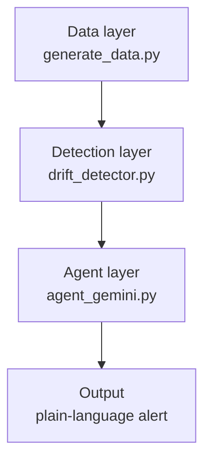

# Drift monitoring agent

An AI agent that watches streaming sensor telemetry, statistically detects
when it drifts away from normal, and uses an LLM to explain the drift in
plain language with a root-cause hypothesis — the way a process engineer
would want to see it on a dashboard, not as a raw anomaly score.

Built as a from-scratch exploration of applying drift-detection methodology
(originally developed for comparing frozen vs. fine-tuned model activations
in my thesis work) to a new domain: manufacturing process telemetry.

## Why this project

Semiconductor and other high-precision manufacturing depends on catching
process drift early — a slowly wearing tool, a drifting sensor calibration,
or a sudden recipe change can all silently degrade yield long before a hard
failure occurs. This project is a small, self-contained demonstration of the
core pattern used in real production monitoring systems: cheap statistics
running continuously, with an LLM invoked only when something is actually
worth a human's attention.

## Architecture



**Data layer** — generates synthetic sensor telemetry with a known baseline,
a gradual-drift region, and a sudden-shift region, so the detector's output
can be checked against ground truth.

**Detection layer** — pure statistics, zero API calls. Computes the
[Population Stability Index (PSI)](https://en.wikipedia.org/wiki/Population_stability_index)
between a reference window and a sliding current window, flagging
`stable` / `moderate_drift` / `significant_drift`.

**Agent layer** — only runs when the detection layer flags something. Takes
the raw statistical evidence (PSI score, time window, mean shift) and asks
an LLM (Gemini) to explain it in plain language with a root-cause hypothesis
and a recommended next action.

This three-layer split is a deliberate design choice, not an accident: an
LLM call on every data point would be slow and needlessly expensive.
Statistics are cheap and run on everything; the LLM only runs on the
handful of events that are actually worth explaining.

## Setup

```bash
pip install numpy pandas google-genai
export GEMINI_API_KEY="your_key_here"   # free key: aistudio.google.com/apikey
```

## Usage

```bash
python3 generate_data.py   # writes data/sensor_stream.csv
python3 pipeline.py        # runs detection + agent, prints alerts
```

Without `GEMINI_API_KEY` set, `pipeline.py` automatically falls back to a
mock agent (`agent_mock.py`) so the full pipeline can still be run and
tested without API access or cost.

## Example output

```
ALERT — window 800-900  (PSI=0.36, significant_drift)
----------------------------------------------------------------------
Between 13:20 and 14:59, the sensor telemetry showed a significant upward
shift, with average readings rising from the expected baseline of 50.0 up
to 50.99. Because this elevation accumulated steadily across nearly 100
minutes rather than spiking instantly, the most likely cause is gradual
tool wear or thermal buildup in the system. I recommend performing a
physical inspection of the tool for wear and verifying its tolerances
before starting the next production run.
```

## Design decisions and real issues hit along the way

Documenting these because they were genuine debugging moments, not just
smooth implementation — and they're a more honest picture of the process
than a README that only shows the happy path.

- **PSI over a simple mean/std comparison** — PSI compares full
  distribution shape bucket-by-bucket, so it catches spread/shape changes
  that a mean-only comparison would miss.
- **Reference-window bucket edges** — buckets are built from the reference
  window's quantiles only, not the combined data, so a real shift doesn't
  get diluted across bins.
- **Early false-positive at a window boundary** — during testing, a window
  slightly before the true drift onset triggered `significant_drift`. Root
  cause: window size and step size trade off sensitivity against false
  positives — a real, unavoidable tuning decision in any drift-monitoring
  system, not a bug to "solve" away.
- **PSI saturation** — once a current window's values fall entirely outside
  the reference distribution's outer buckets, PSI stops increasing even as
  the true mean keeps moving. In production this is why PSI is typically
  paired with a secondary metric (e.g. raw mean/std) to keep distinguishing
  severity past saturation.
- **Alert de-duplication bug** — an early version of the event-detection
  logic filtered to `significant_drift` rows *before* checking for state
  transitions, which silently merged two distinct real events into one
  because the filtering discarded the in-between `moderate_drift` row that
  would have shown the gap. Fixed by detecting transitions on the full,
  unfiltered scan.
- **SDK migration mid-project** — Google deprecated the `google-generativeai`
  package and the `gemini-2.0-flash` model during development. Migrated to
  the current `google-genai` package and `gemini-3.6-flash`, and added
  retry-with-backoff for transient `503` errors, since any code calling an
  external API has to tolerate the API occasionally being unavailable.

## Future work

- Multi-sensor support with cross-sensor correlated drift patterns
- Swap the synthetic generator for real public semiconductor test-log data
- A lightweight dashboard (e.g. Streamlit) instead of console output
